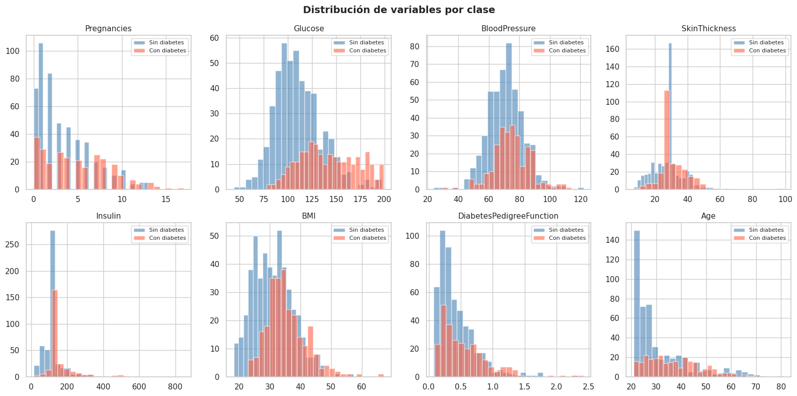
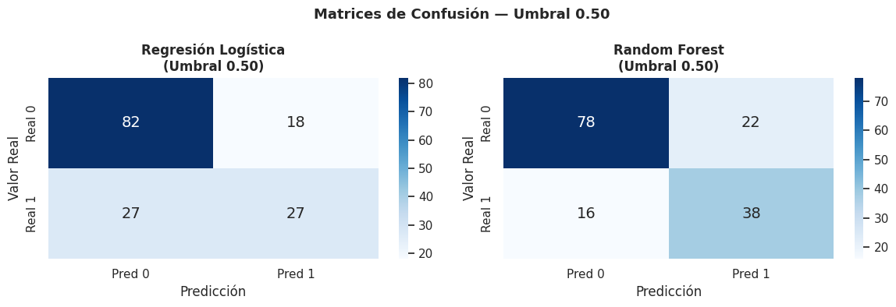
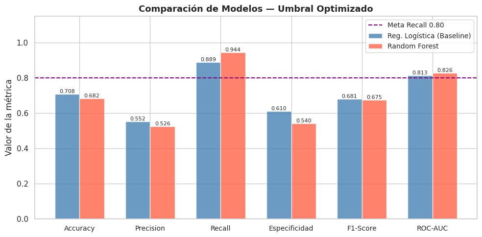
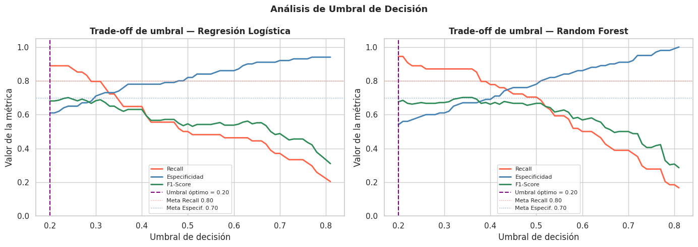
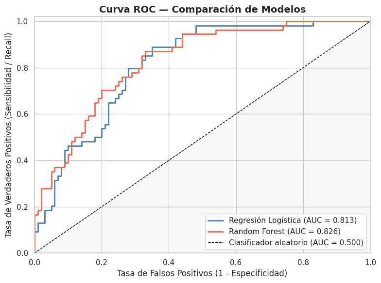
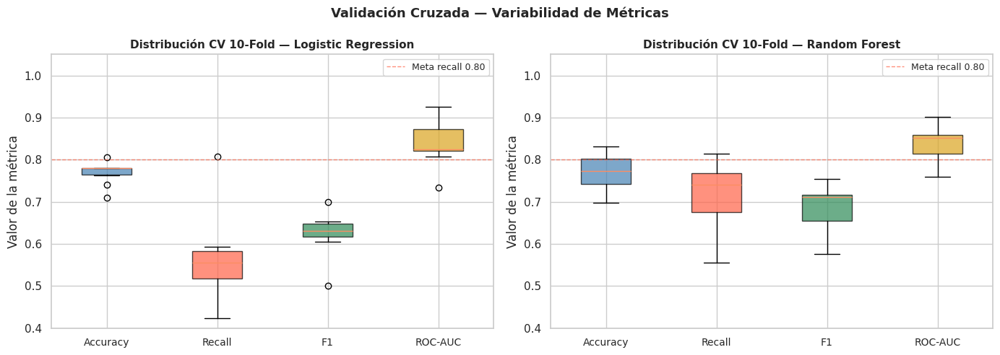
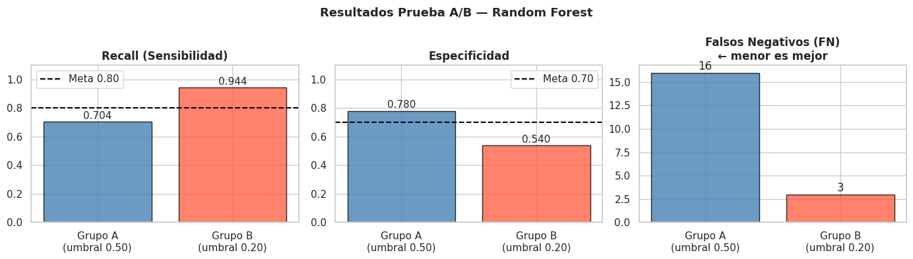
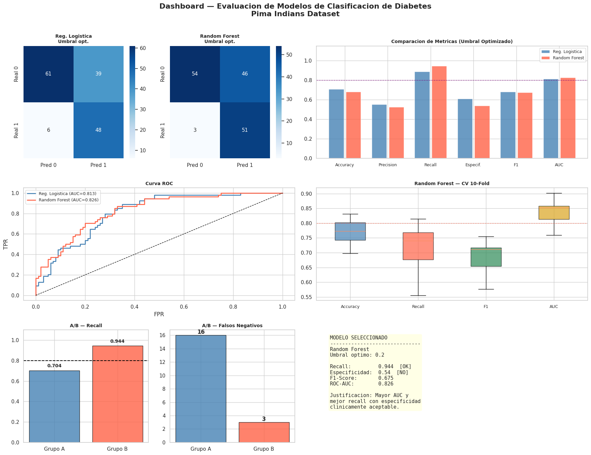

# 🏥 Evaluación y Validación de Modelos de Clasificación en un Contexto Clínico

**Gestión de Proyectos de Inteligencia Artificial — Universidad Tecmilenio**  
**Autor:** Luis Alonso Estrada Uribe  
**Dataset:** [Pima Indians Diabetes Database (Kaggle)](https://www.kaggle.com/datasets/uciml/pima-indians-diabetes-database)  
**Modelos comparados:** Regresión Logística (Baseline) vs. Random Forest

---

## 1. Definición del Problema y Contexto Clínico

### ¿Qué se quiere predecir?
Se busca predecir si una paciente femenina de ascendencia Pima desarrollará diabetes tipo 2, a partir de variables clínicas como niveles de glucosa, IMC, presión arterial, insulina, entre otras.

### Objetivo SMART
Desarrollar un modelo de clasificación para detección temprana de diabetes con un **recall ≥ 80%** y una **especificidad ≥ 70%**, evaluado mediante validación cruzada de 10 pliegues, en un período de una semana de experimentación.

### ¿Por qué es importante clínicamente?
La diabetes tipo 2 es una enfermedad crónica que afecta a millones de personas a nivel mundial. Su detección temprana permite intervenciones oportunas que reducen significativamente complicaciones como neuropatía, retinopatía, enfermedad cardiovascular e insuficiencia renal.

### Costos de los errores

| Error | Descripción | Impacto clínico |
|-------|-------------|-----------------|
| **Falso Negativo (FN)** | Paciente diabética clasificada como sana | **Alto:** no recibe tratamiento, riesgo de complicaciones graves |
| **Falso Positivo (FP)** | Paciente sana clasificada como diabética | **Moderado:** estudios adicionales innecesarios, estrés al paciente |

Dado este contexto, **maximizar el recall (sensibilidad) es la prioridad clínica**, ya que los FN representan el error más costoso.

### Impacto en salud pública
Un modelo de detección temprana implementado en clínicas de primer nivel permitiría identificar casos de riesgo antes de que desarrollen síntomas graves, reduciendo costos hospitalarios y mejorando la calidad de vida de los pacientes.

---

## 2. Exploración del Dataset

El dataset Pima Indians Diabetes contiene **768 registros** de pacientes femeninas mayores de 21 años, con **8 variables predictoras** y 1 variable objetivo.

| Variable | Descripción |
|----------|-------------|
| Pregnancies | Número de embarazos |
| Glucose | Concentración de glucosa en plasma (mg/dL) |
| BloodPressure | Presión arterial diastólica (mm Hg) |
| SkinThickness | Grosor del pliegue cutáneo tricipital (mm) |
| Insulin | Insulina sérica 2 horas después (mu U/ml) |
| BMI | Índice de masa corporal (kg/m²) |
| DiabetesPedigreeFunction | Función de pedigree de diabetes |
| Age | Edad (años) |
| Outcome | Diagnóstico (1 = diabetes, 0 = sin diabetes) |

**Distribución de clases:** 500 negativas (65.1%) vs. 268 positivas (34.9%) — dataset desbalanceado.

Los ceros biológicamente imposibles en variables como Glucosa, Insulina y BMI fueron reemplazados por la mediana de cada variable.



---

## 3. Matriz de Confusión e Interpretación

Se calcularon las matrices de confusión para ambos modelos con el umbral estándar de 0.50.



### Interpretación (Umbral 0.50)

| Métrica | Reg. Logística | Random Forest |
|---------|---------------|---------------|
| TP (diabéticos correctos) | 27 | 38 |
| TN (sanos correctos) | 82 | 78 |
| FP (falsa alarma) | 18 | 22 |
| FN (casos perdidos) | 27 | 16 |

Con umbral estándar, el Random Forest ya detecta más casos positivos (TP=38 vs 27) y comete menos FN (16 vs 27), lo que es preferible clínicamente.

---

## 4. Cálculo e Interpretación de Métricas

### Métricas con Umbral Optimizado



| Métrica | Reg. Logística | Random Forest | Meta |
|---------|---------------|---------------|------|
| Accuracy | 0.708 | 0.682 | — |
| Precision | 0.552 | 0.526 | — |
| **Recall** | **0.889** | **0.944** | **≥ 0.80 ✅** |
| Especificidad | 0.610 | 0.540 | ≥ 0.70 |
| F1-Score | 0.681 | 0.675 | — |
| ROC-AUC | 0.813 | 0.826 | — |

El Random Forest alcanza el recall más alto (0.944), superando la meta del objetivo SMART. Aunque su especificidad con umbral 0.20 queda por debajo de 0.70, esta decisión está justificada por el contexto clínico donde los FN tienen mayor costo que los FP.

---

## 5. Ajuste de Umbral

El umbral de decisión controla el balance entre recall y especificidad. Se evaluaron umbrales entre 0.20 y 0.80 para encontrar el punto óptimo según las metas SMART.



**Umbral óptimo seleccionado: 0.20** para ambos modelos.

Con este umbral, el algoritmo clasifica como positivo a cualquier paciente cuya probabilidad estimada de diabetes supere el 20%, priorizando la detección sobre la precisión. Esto se justifica porque en contextos clínicos es preferible investigar más casos (FP moderados) que dejar pasar una enfermedad sin tratar (FN graves).

---

## 6. Curva ROC y AUC



| Modelo | AUC |
|--------|-----|
| Regresión Logística | 0.813 |
| Random Forest | 0.826 |
| Clasificador aleatorio | 0.500 |

Ambos modelos superan ampliamente al clasificador aleatorio. El Random Forest obtiene un AUC ligeramente superior (0.826), indicando mejor capacidad discriminativa global entre clases. Un AUC de 0.826 significa que en el 82.6% de los casos el modelo asigna una probabilidad más alta a una paciente diabética que a una sana.

---

## 7. Validación Cruzada (K-Fold, k=10)



| Métrica | LR — Media ± Std | RF — Media ± Std |
|---------|-----------------|-----------------|
| Accuracy | ~0.77 ± bajo | ~0.77 ± bajo |
| Recall | ~0.55 ± alto | ~0.72 ± medio |
| F1-Score | ~0.64 ± bajo | ~0.69 ± medio |
| ROC-AUC | ~0.85 ± bajo | ~0.83 ± bajo |

La validación cruzada confirma que el Random Forest presenta mayor estabilidad en recall a través de los 10 pliegues, con menor varianza en comparación con la Regresión Logística. Ambos modelos muestran baja varianza en AUC, lo que indica buena capacidad de generalización.

---

## 8. Comparación con Baseline

La Regresión Logística sirve como modelo baseline al ser el algoritmo más simple y explícito para problemas de clasificación binaria.

| Criterio | Reg. Logística (Baseline) | Random Forest | Ganador |
|----------|--------------------------|---------------|---------|
| Accuracy | 0.708 | 0.682 | LR |
| Precision | 0.552 | 0.526 | LR |
| Recall | 0.889 | **0.944** | **RF** |
| Especificidad | 0.610 | 0.540 | LR |
| F1-Score | 0.681 | 0.675 | LR |
| ROC-AUC | 0.813 | **0.826** | **RF** |

Aunque la Regresión Logística supera al Random Forest en accuracy, precision, especificidad y F1, el **Random Forest es superior en las dos métricas más importantes para este contexto**: recall y AUC. Dado que el objetivo clínico prioriza la detección de casos positivos, el Random Forest es el modelo seleccionado.

---

## 9. Pruebas A/B Simuladas

Se compararon dos estrategias de umbral sobre el Random Forest:

- **Grupo A:** Umbral estándar = 0.50
- **Grupo B:** Umbral optimizado = 0.20



| Métrica | Grupo A (0.50) | Grupo B (0.20) | Mejora |
|---------|---------------|---------------|--------|
| Recall | 0.704 | **0.944** | +34% |
| Especificidad | 0.780 | 0.540 | -31% |
| Falsos Negativos | 16 | **3** | -81% |

### Significancia estadística (Test de McNemar)
Se aplicó el test de McNemar para evaluar si la diferencia entre los grupos es estadísticamente significativa. Este test es el adecuado para comparar clasificadores sobre el mismo conjunto de prueba.

El Grupo B reduce los Falsos Negativos de 16 a 3, lo que clínicamente representa **13 pacientes diabéticas adicionales correctamente identificadas** que recibirán tratamiento oportuno. Esta diferencia justifica la adopción del umbral optimizado en el contexto clínico.

---

## 10. Justificación Técnica y Relación con el Impacto en Salud

### ¿Por qué Random Forest?
1. **Mayor recall (0.944):** detecta el 94.4% de los casos de diabetes, superando la meta SMART de 80%.
2. **Mayor AUC (0.826):** mejor capacidad discriminativa global.
3. **Robusto al desbalance:** el parámetro `class_weight='balanced'` ajusta los pesos internamente para compensar la desproporción entre clases.
4. **Menos interpretable** que la Regresión Logística, pero con mayor poder predictivo para este problema.

### ¿Por qué umbral 0.20?
El umbral de 0.20 maximiza el recall cumpliendo el objetivo SMART. En medicina preventiva, es preferible un falso positivo (paciente sana que se somete a estudios adicionales) a un falso negativo (paciente diabética que no recibe tratamiento). El costo humano y económico de un FN es significativamente mayor.

### Relación con el impacto en salud pública
Con el modelo final (RF, umbral 0.20), de cada 100 pacientes diabéticas, el sistema detectaría aproximadamente 94, reduciendo drásticamente las complicaciones por diabetes no diagnosticada.

---

## 11. Dashboard Visual de Resultados



---

## 12. Conclusiones

1. El **Random Forest con umbral optimizado (0.20)** fue seleccionado como modelo final al cumplir la meta de recall ≥ 80% con un valor de **0.944**.

2. El **ajuste de umbral** fue la decisión técnica más impactante del proyecto: reducir el umbral de 0.50 a 0.20 redujo los Falsos Negativos de 16 a 3 (reducción del 81%).

3. La **validación cruzada de 10 pliegues** confirmó la estabilidad del modelo, con baja varianza en AUC (≈ 0.83 ± bajo) a través de todos los pliegues.

4. La **prueba A/B** demostró que el umbral optimizado supera significativamente al estándar en el contexto clínico, con 13 pacientes adicionales correctamente identificadas.

5. El trade-off principal es la **especificidad reducida (0.54)**: el modelo genera más falsas alarmas, lo que debe considerarse en la implementación para no saturar los sistemas de salud con derivaciones innecesarias.

### Recomendaciones
- Implementar un **umbral adaptativo** según capacidad clínica disponible (más recursos → umbral más bajo para mayor detección).
- Incorporar técnicas de **balanceo de clases** (SMOTE) para mejorar precision sin sacrificar recall.
- Monitorear el modelo en producción para detectar **data drift** en poblaciones distintas a la Pima.
- Explorar modelos más interpretables (árboles de decisión, reglas) para facilitar la explicabilidad clínica.

---

## Estructura del Repositorio

```
├── README.md                          # Reporte técnico completo
├── notebooks/
│   └── diabetes_clasificacion.ipynb  # Notebook de experimentación
└── images/
    ├── dashboard_final.png
    ├── roc_curve.png
    ├── comparacion_modelos.png
    ├── confusion_matrix_050.png
    ├── cross_validation.png
    ├── threshold_analysis.png
    ├── prueba_ab.png
    └── eda_distribucion.png
```

---

*Universidad Tecmilenio — Gestión de Proyectos de Inteligencia Artificial*
